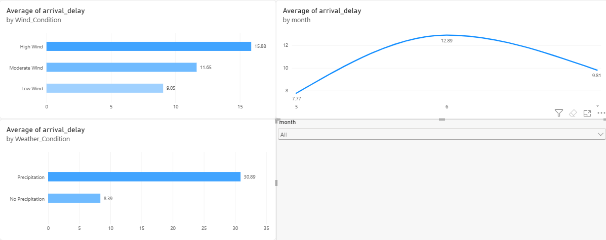

# Weather Impact on Flight Delays

End-to-end analysis of how weather conditions (precipitation, temperature, wind speed) affect U.S. domestic flight delays, using SQL, statistical hypothesis testing, and an interactive Power BI dashboard.

## Business Case
Airlines lose significant revenue and customer trust due to flight delays. While weather is commonly blamed, it's unclear how much of the delay is actually weather-driven versus other operational factors. This analysis quantifies weather's real impact on delays using real flight and weather data, and tests whether the relationship is statistically significant or just commonly assumed.

## Business Questions
- Which weather conditions correlate most with delays?
- Are delays significantly higher on bad-weather days, or is this assumption overstated?
- Which routes/airports are most weather-vulnerable?
- Can airlines use this to improve scheduling buffers?

## Dataset
**Source:** [Historical Flight Delay and Weather Data](https://www.kaggle.com/datasets/ioanagheorghiu/historical-flight-and-weather-data) (Kaggle)
**Time Period Analyzed:** May - July 2019 (3 of 8 available months)
**Size:** 2,058,732 clean flight records after filtering cancelled flights and missing weather data

**Note:** Raw data files are excluded from this repository due to GitHub's 100MB file size limit. Download the original dataset from the Kaggle link above to reproduce.

## Key Findings
- **Precipitation is the strongest delay driver.** Flights during precipitation averaged 30.89 minutes of delay vs. 8.39 minutes with no precipitation — a statistically significant, nearly 4x difference (t-test, p < 0.001).
- **Wind speed shows a clear, meaningful trend** — average delay rises from 9.05 min (low wind) to 15.88 min (high wind), a ~75% increase (p < 0.001).
- **Temperature has a statistically significant but practically minor effect** — under 2 minutes difference between hot and normal-temperature flights, despite p < 0.001.
- **June had the worst delays** (12.89 min avg) of the three months, coinciding with the highest average precipitation.
- **Major hub airports (EWR, ORD, DEN)** show high average delays, though this isn't fully explained by airport-level precipitation — suggesting congestion plays a role too.
- **The typical flight isn't actually late** — median delay is -5 minutes (early), while the mean is 10.15 minutes, revealing a right-skewed distribution driven by a smaller number of severely delayed flights.

## Recommendations
- Prioritize precipitation-based scheduling buffers over temperature-based ones.
- Flag high-wind days (>20mph) for proactive schedule adjustments, especially at congestion-prone hubs.
- Investigate hub-specific operational factors (not just weather) at EWR, ORD, and DEN.
- Communicate delay expectations using median-based framing for typical passengers.

## Limitations
- Analysis covers only May-July 2019 (summer) - winter weather patterns aren't represented.
- Findings show correlation, not full causation - confounding factors (air traffic control, cascading delays) aren't isolated.

## Tools Used
Python, Pandas, SQLite (SQL), SciPy (statistical testing), Matplotlib, Power BI

## How to Run
1. Clone this repository
2. Download the dataset from the Kaggle link above into `data/raw/`
3. Install dependencies: `pip install pandas numpy matplotlib scipy`
4. Open `weather_flight_analysis.ipynb` in Jupyter
5. Open the Power BI dashboard file in Power BI Desktop to view the interactive dashboard

## Interactive Dashboard

